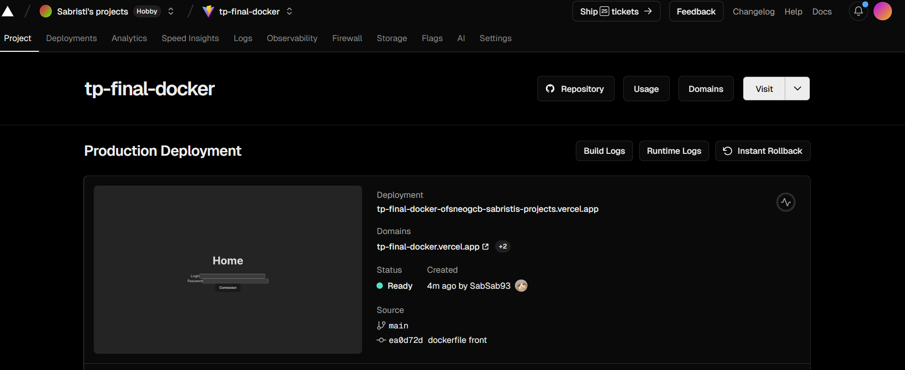
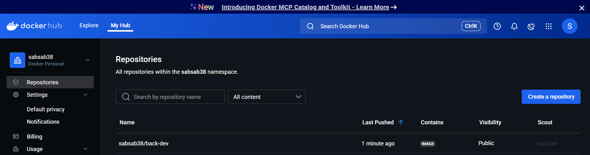
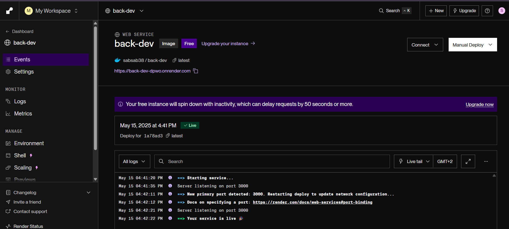
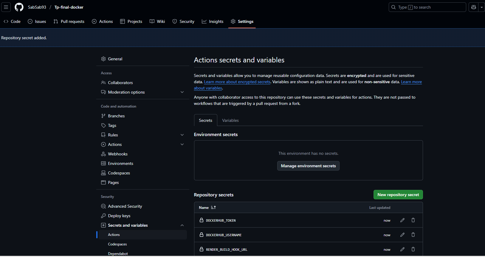

## Partie 1 - Dockerisation du front (5 points)

### Fichier Dockerfile crée dans la racine du front

```bash
FROM node:20-alpine

WORKDIR /app

COPY package*.json ./
RUN npm install     

COPY . .

EXPOSE 5001

CMD ["npm", "run", "dev", "--", "--host", "0.0.0.0", "--port", "5001"]
```
Difficulté lors dulancement du build initilement je souhaite le lancer avec ce model de Dockerfile : 
```bash
FROM node:20-alpine

WORKDIR /app

RUN npm i -g serve

COPY package.json package-lock.json* ./
RUN npm install

COPY . .
RUN npm run build

EXPOSE 5001
CMD ["serve", "-s", "dist", "-p", "5001"]
```
Mais cela n'a pas fonctionné 

### Commande pour creer l'image 
```bash
docker build -t sabsab38/front-dev .
```
### Commande pour run l'image
```bash
docker run --rm -p 5001:5001 sabsab38/front-dev
```

## Dockerisation du back

### Fichier Dockerfile crée dans la racine du back

```bash
FROM node:20-alpine

WORKDIR /app

COPY package*.json ./
RUN npm install

COPY . .

EXPOSE 3000

CMD ["node", "dist/index.js"]
```

### Commande pour creer l'image 
```bash
docker build -t sabsab38/back-dev .
```
### Commande pour run l'image
```bash
docker run --rm -p 1992:3000 sabsab38/back-dev
```


## Mise en production


### Front

1. J'ai créé un repo sur git mon .git est dans le projet TP-FINAL-DOCKER
2. J'ai forké le back et le front afin de pouvoir push dans le main
3. Dans le front j'ai utilisé VERSEL 
    - en recuperant le depot front : https://github.com/SabSab93/client-livres
    
    - creeant un new project à partir du repo git : 
    https://vercel.com/sabristis-projects/tp-final-docker

### Back
1. Dans docker desktop je push l'image dans dockerhub
        
        Ou bien je peux taper la commande suivante : 
```bash
docker login -u sabsab38
docker push sabsab38/back-dev
```
        Je n'ai pas mis de tag par defaul c'est latest

Voici le repo créé dans DockerHub : 


2. Avec l'image du DockerHub on peux creer une render à partir de cette image : sabsab38/back-dev




3. Le back est disponible : https://back-dev-dpwo.onrender.com/
4. Les livres : https://back-dev-dpwo.onrender.com/books

### Automatiser avec git
1. Creer un repertoire .github/workflows
2. Creer un fichier docker.yaml

```bash
name: Docker
on:
  push:
    branches: [main]
  pull_request:
    branches: [main]
jobs:
  build:
    runs-on: ubuntu-latest
    steps:
      - uses: actions/checkout@v3
      - name: Login to DockerHub
        run: echo "${{ secrets.DOCKERHUB_TOKEN }}" | docker login -u "${{ secrets.DOCKERHUB_USERNAME }}" --password-stdin
      - name: Build Docker image
        run: docker build -t ${{ secrets.DOCKERHUB_USERNAME }}/demo-test:github-actions .
      - name: Push Docker image
        run: docker push ${{ secrets.DOCKERHUB_USERNAME }}/demo-test:github-actions
      - name: Render Build Hook
        run: |
          echo "Pinging Render build hook…"
          curl -X POST "${{ secrets.RENDER_BUILD_HOOK_URL }}"
```

3. Creation de variable dans git 
DOCKERHUB_TOKEN : on recupere dans le setting de dockerHub
DOCKERHUB_USERNAME : c'est notre user name de dockerHub : sabsab38
RENDER_BUILD_HOOK_URL : on le retrouve dans le projet render partie Hoock


4. A chaque push on va pouvoir build / push et deployer dans le back et le front, cela evite de taper les commandes à la mano


## Docker compose

### Docker-compose.yaml 

```bash
services:
  back:
    build:
      context: ./back
      dockerfile: Dockerfile
    ports:
      - "1992:3000"        
    env_file:
      - ./back/.env        
  front:
    build:
      context: ./front
      dockerfile: Dockerfile
    ports:
      - "5001:5001"
    environment:
      API_URL: "https://back-dev-dpwo.onrender.com/"
    depends_on:
      - back            
```
